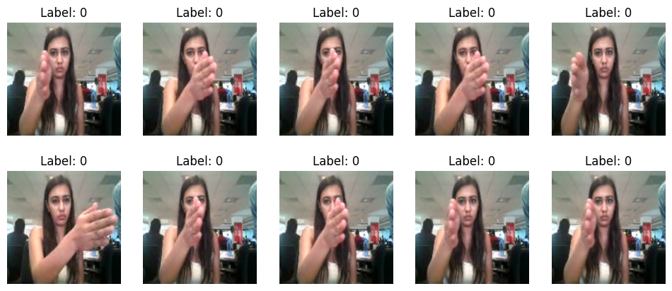
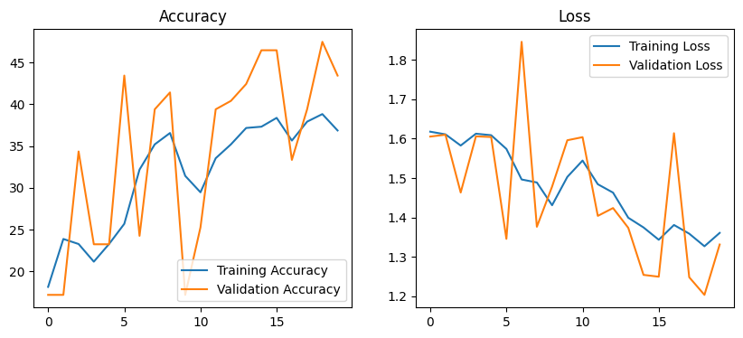

# Upgrad Gesture Recognition Assignment

## Problem Statement

Develop a gesture recognition feature for smart-TV that can recognise five different gestures performed by the user which will help users control the TV without using a remote.

Each gesture corresponds to a specific command below,

- Thumbs up:  Increase the volume
- Thumbs down: Decrease the volume
- Left swipe: 'Jump' backwards 10 seconds
- Right swipe: 'Jump' forward 10 seconds  
- Stop: Pause the movie

## Data

The training data consists of 'train' and a 'val' folders along with tran.csv and val.csv files representing content two folders.

These folders are in turn divided into subfolders where each subfolder represents a video of a particular gesture. Each subfolder, i.e. a video, contains 30 frames (or images). Note that all images in a particular video subfolder have the same dimensions but different videos may have different dimensions. Specifically, videos have two types of dimensions - either 360x360 or 120x160 (depending on the webcam used to record the videos). Hence, you will need to do some pre-processing to standardise the videos. 

Each row of the CSV file represents one video and contains three main pieces of information - the name of the subfolder containing the 30 images of the video, the name of the gesture and the numeric label (between 0-4) of the video.

The dataset can be downloaded from https://drive.google.com/uc?id=1ehyrYBQ5rbQQe6yL4XbLWe3FMvuVUGiL

## Data Loading

Pytorch Dataset and DataLoaders are used to load images and labels.

### Sample image frames

## Model

For video image frames classfication, A combination of Convolutional Neural Networks (CNN) and Long Short-Term Memory (LSTM) network is used.

LSTM followed by CNN approach adopted where CNN extracts features from the image frames and then feed these features into an LSTM for classification. This allows the CNN to capture local patterns in the data while the LSTM can learn the temporal dependencies and make the final prediction.

Below diagram depicts high-level model architecture,

## Training & Validation

The model has been trained with batch size of '4' and 20 epochs.

Below digram depicts train and test loss and accuracy,

## Submission

The submission includes following files,

1. gesture-recognition.ipynb
2. Model export in the form of 